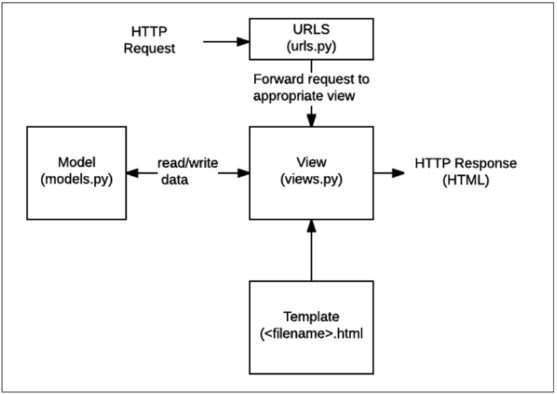

# Django

# 장고란?

서버를 구현하는 웹 프레임 워크

### 규약

- 니가 만든건 앞으로 원래있던건 뒤로

### 서론

- 장고에는 규약이 존재한다.
  
    → 안정적이다, 기본 보안이 좋다.
    
- 정부쪽은 자바스프링, 화해, 토스 두나무 등은 장고
- 웹은 클라이언트-서버구조로 되어있다.
- 정적 웹페이지와 동적 웹페이지
    - 정적 : 모든 사용자에게 **동일한 모습**으로 전달되는 웹페이지
    - 동적 : 사용자의 **요청에 따라 수정**이되어 전달되는 웹페이지
        - 웹페이지의 내용을 바꿔주는 주체 = **서버**
        - 서버에서 동작하고 있는 프로그램이 웹페이지를 변경해준다. 이렇게 **사용자의 요청을 받아서 적절한 응답**을 만들어주는 프로그램을 **쉽게** 만들 수 있게 도와주는 프레임워크가 바로 Django

## Django 구조 이해하기 (MTV Design Pattern)

### Design Pattern이란?

- 자주 사용되는 구조가 있다는 것을 알게되었고, 이를 패턴화 한 것
- 특정 문맥에서 공통적으로 발생하는 문제를 해결하는데 형식화 된 가장 좋은 관행

### Django에서의 디자인 패턴

- 장고에서는 **MTV패턴**이 쓰이고**, MVC 패턴을 조금 변형한 것이다.**

### MVC 소프트웨서 디자인 패턴

- Model Vew Controller의 준말
- 하나의 큰 프로그램을 세가지 역할로 구분한 개발 방법론
    1. Model: 데이터와 관련된 로직**(저장, 삭제, 수정)**을 관리
    2. View: 레이아웃과 화면을 처리 **(html)**
    3. Controller: 명령을 **model(DB)**과 **view** 부분으로 연결 **(분석파트)**
        1. ~~모델 명령과 뷰 명령을 나눠서 가져서… . .. ..~~
- MVC 소프트웨어 디자인패턴의 목적
    - 관심사 분리
    - 더 나은 업무의 분리와 향상된 관리 제공
    - 독립적으로 개발할 수 있다. == 유지보수 쉬워짐, 다수의 멤버로 개발 용이
- MVC = Model, View, Controller
- MTV = Model, Template, View(=Controller)
    - View(=Controller)
        - Model & Template과 관련된 로직을 처리해서 응답을 반환
        - 클라이언트의 요청에 처리를 분기하는 역할
        - 동작 예시: 데이터가 필요하다면 mode에 접근해서 데이

### 디자인패턴 요약도



1. URLS 경로설정
2. 처리데이터
3. 새로운 HTML만드는 것 = Template
4. 다시 View가 내보낸다.

### 가상환경 생성

- git bash 가상환경 세팅

```bash
python -m venv venv
#가상환경생성: venv= 파이썬명령어 venv= 가상환경 이름

source venv/Scripts/activate  #가상환경생성
pip install django==3.2.15    #장고설치
pip freeze > requirements.txt #설치된 버전리스트를 저장하는 txt파일 생성

pip install -r requirements.txt #requirements에 있는 내용 설치

deactivate #가상환경 해제

django-admin startproject firstpjt . #프로젝트 이름에는 사용중인 키워드 및 '-'사용불가
#'.'을 붙이지 않을 경우 현재 디렉토리에 프로젝트 디렉토리를 새로 생성하게 됨 

python manage.py startapp articles #애플리케이션(앱)생성, 일반적으로 복수형으로 작성한다.
# $INSTALLED_APPS에 생성 후 적어야함$ 미리 작성하고 생성하면 앱이 생성되지 않음
# articles = 앱이름

python manage.py runserver #서버 구동
# http://127.0.0.1:8000/를 통해 확인
```

### 프로젝트 구조

pjt속 python파일 구조

- `asgi.py` = Asynchronous Server Gateway Interface
  
    장고 애플리케이션이 비동기식 웹 서버와 연결 및 소통하는 것을 도움
    
- **`settings.py`**
  
    장고 프로젝트 설정을 관리
    
    - INSTALLED_APPS = Django installation에 활성화 된 모든 앱을 지칭하는 문자열 목록
- `**urls.py**`
  
    사이트 url과 적절한 views의 연결을 지정
    
    - 
- `wsgi.py` = Web Server Gateway Interface
  
    장고 애플리케이션이 웹서버와 연결 및 소통하는 것을 도움
    
- `manage.py`
  
    장고 프로젝트와 다양한 방법으로 상호작용하는 커맨드라인 유틸리티
    

### 애플리케이션 구조

migrations속 파일구조

- `__init**__**.py`
- `admin.py`
- `apps.py`
- `models.py`
- `test.py`
- `view.py`

### 기타) git ignore

1. git init
2. .git폴더가 있는 곳으로 가서
3. .gitignore 파일을 만들어서 입력
   
    ```bash
    venv/
    ```
    

### 요청과 응답

URL → VIEW → TEMPLATE로 데이터흐름을 이해하기

1. `urls.py` 파일 속 path를 설정해준다.
    1. `from articles import views` 
    2. `path(’index/’, views.index)`  path(경로이름, 함수이름)
    
    ```bash
    # urls.py
    from articles import views
    path('index/', views.index)
    ```
    
2. #경로있으면 views.py로가서 index처리한다.  #경로없으면 404
3. `views.py`에서 `return render(request, ‘index.html’)` 하면 Template로 넘어간다.
   
    ```bash
    def index(request):
        return render(request, 'index.html')
    ```
    
    - render(request, template_name, context)
        - 주어진 템플릿을 주어진 컨텍스트 데이터와 결합하고 렌더링 된 텍스트와 함께 HttpResponse(응답) 객체를 반환하는 함수
    - view에 파일을 만들 때 request를 첫번째 매개변수로 받는 것이 컨벤션이다.

앱 및에 templates폴더가 있는 것이 규약이다. 그 안에 index가 존재해야한다.

## Django Template

### Django Template Language(DTL)

- Django template에서 사용하는 built-in template system
- 조건, 반복, 변수 치환, 필터 등의 기능을 제공
    - **Python 코드로 실행되지 않음**
- 프로그래밍적 로직이 아닌 프레젠테이션을 표현하기 위한 것임을 명심

### DTL Syntax

1. Variable 변수 `{{ variable }}`
    - dot(.)를 사용하여 변수 속성에 접근할 수 있음
    - render()의 세번째 인자로{’key’:value}와 같이 딕셔너리 형태로 넘겨준다.
2. Filters 필터 `{{ variable|filter }}`
    - 표시할 변수를 수정할 때 사용
    - 예시) name 변수를 모두 소문자로 출력 `{{ name|lower }}`
    - chained가 가능하며 일부 필터는 인자를 받기도 함 `{{ name|truncatewords:30 }}`
3. Tag 태그 ``
    - 출력 텍스트를 만들거나, 반복 또는 논리를 수행하여 제어흐름을 만드는 등 변수보다 복잡한 일들을 수행
    - 일부 태그는 시작과 종료 태그가 필요 ``, ``
    - 한줄 주석 `{# #}` , ``
    

## Template inheritance 템플릿 상속

- 템플릿 상속은 코드의 재사용성에 초점을 맞춘다.
- 상속을 사용하면 사이트의 모든 공통 요소를 포함하고, 하위 템플릿이 재정의(override)할 수 있는 블록을 정의하는 기본 ‘skeleton’템플릿을 만들 수 있음

``

- **자식(하위)템플릿이 부모 템플릿을 확장한다는 것을 알림**
- 반드시 템플릿 **최 상단**에 작성되어야함(즉, 2개 이상 사용할 수 없음)

``

- **하위템플릿에서 재지정(overridden)할 수 있는 블록을 정의**
- 즉, 하위 템플릿이 채울 수 있는 공간
- 가독성을 높이기 위해 선택적으로 endblock 태그에 이름을 지정할 수 있음

### 템플릿 경로 추가하기

앱안의 template디렉토리가 아닌 프로젝트 최상단의 templates 디렉토리 안에 위치시키고 싶다면?

`settings.py` → `TEMPLATES=[…{**’DIRS’: [BASE_DIR / ‘templates’, …}]**`,

- BASE_DIR : 프로젝트가 생성된 디렉토리

기타

- 지금 만들던 것은 완성된 html이 아니기때문에 template을 만들었다고 이야기한다.

## Sending and Retrieving form data

- “데이터를 어디(action)로 어떤 방식(method)으로 보낼지”
- HTML form element를 통해 사용자와 애플리케이션 간의 상호작용 이해하기
- 웹에서 사용자 정보를 입력하는 여러방식(text, button, submit 등)을 제공하고, 사용자로부터 할당된 데이터를 서버로 전송하는 역할을 담당

### 핵심속성

- action
    - 입력 데이터가 전송 될 URL을 지정
    - 데이터를 어디로 보낼 것인지 지정하는 것이며 이 값은 반드시 유효한 URL이여야함
    - 속성을 지정하지 않으면 데이터는 현재 form이 있는 페이지의 URL로 보내짐
- method
    - 데이터를 어떻게 보낼 것인지 정의
    - 입력 데이터의 HTTP request method를 지정
    - HTML form 데이터는 오직 2가지 방법으로만 전송 할 수 있는데 바로 GET방식과 POST방식

### 예제

- throw

```bash


    <h1>Throw</h1>
    <form action="/catch/" method="GET">
        <label for="message">Throw</label>
        <input type="test" id="message" name="message">
        <input type="submit">
    </form>

```

- catch

```bash


    <h1>Catch</h1>
    <h2>여기서 {{ message }}를 받았어</h2>
    <a href="/throw/">다시 던지러가자</a>

```

## Django URLs

“Dispatcher(운행관리원)로서의 URL 이해하기”

웹 어플리케이션은 URL을 통한 클라이언트의 요청에서부터 시작함

### Trailing Slashes

### Variable routing

- URL의 일부를 변수로 지정하여 view 함수의 인자로 넘길 수 있음
- 즉, 변수 값에 따라 하나의 path()에 여러 페이지를 연결 시킬 수 있음

```
//urls.py
path('hello/<name>/', views.hello),
```

### App URL mapping(1/3)

- 앱이 많아졌을 때 urls.py를 각 app에 매핑하는 법을 이해하기
- 두번째 app인 pages를 생성 및 등록하고 진행
- app의 view함수가 많아지면서 사용하는 path()또한 많아지고, app또한 더 많이 작성되기 때문에 프로젝트의 urls.py에서 모두 관리하는 것은 프로젝트 유지보수에 좋지 않음

- 하나의 프로젝트의 여러앱이 존재한다면, 각각의 앱 안에 urls.py를 만들고 프로젝트 urls.py에서 각 앱의 urls.py파일로 URL 매핑을 위탁할 수 있음
- 각각의 app 폴더 안에 urls.py를 작성하고 다음과 같이 수정 진행

---

## Namespace의 필요성

서로 다른 앱에서 동일한 URL이름을 사용하는 경우에도 이름이 지정된 URL을 고유하게 사용할 수 있음

- app_name attribute를 작성해 URL namespace를 생성
  
    ```python
    # articles/urls.py
    app_name = 'articles'
    urlpatterns = []
    
    #이후 html에서 이런식으로 사용해야한다. #아닐 시 에러
     --> 
    ```
    
- 오류 NoReverseMatch = url태그 오류
- 장고는 기본적으로 app_name/templates/ 경로에 있는 templates파일들만 찾을 수 있으며, settings.py의 INSTALLED_APPS에 작성한 app순서로 template을 검색 후 렌더링 함\
- 그래서, templates의 기본경로 자체를 변경할 수 없기 때문에 물리적인 이름공간을 만들어야 한다.

# Model

## Database

### 스키마 (Schema)

- 뼈대
- 데이터베이스에서 자료의 구조, 표현방법, 관계등을 정의한 구조

| column | dataType |
| --- | --- |
| id | INT |
| name | TEXT |

### 테이블(Table)

- 필드와 레코드를 사용해 조직된 데이터요소들의 집합
- 관계(Relation)라고도 부름
1. 필드(field): 속성, 컬럼(colum), 열
    - 고유한 데이터 형식이 지정됨
2. 레코드(record): 튜플, 행(Row)
    - 실제 데이터
3. PK(Primary Key)
    - 기본 키
    - 각 레코드의 고유한 값(식별자로 사용)
    - 기술적으로 다른 항목과 **절대로 중복될 수 없는 단일 값(unique)**
    - 테이블간 관계 설정 시 주요하게 활용됨
4. 쿼리(Query)
    - 데이터를 추출, 조회하기 위한 명령어
    - “Query를 날린다” → 데이터베이스를 조작하다
    

## Model

개요

- Django는 Model을 통해 데이터에 접근하고 조작
- 사용하는 데이터들의 필수적인 **필드(Colum)**들과 **동작(OOP관점에서 메서드)**을 포함
- 저장된 데이터베이스의 구조(layout)
- 일반적으로 각각의 모델은 하나의 데이터베이스 테이블에 매핑(mapping)
    - **모델클래스 1개 == 데이터베이스 테이블 1개**
    - 독립적인 데이터 베이스를 장고로 **간접적으로 사용**함
    

### 모델 이해하기

- [models.py](http://models.py) 작성
    - 모델클래스를 작성하는 것은 데이터베이스 테이블의 스키마를 정의하는 것
    - “모델클래스 == 테이블 스키마”
    - 아이디 컬럼은 테이블 생성시 장고가 자동으로 생성

```python
# models.py 작성

#클래스를 만드는것 = 테이블을 만드는 것
class Article(models.Model):
		title = models.CharField(max_length) # 타이틀이 필드의 이름, value는 타입이 된다.
																				 # max_length는 필수 텍스트
		content = models.TextField() # 길이제한이 긴 텍스트

```

- 각 모델은 `models.Model` 클래스의 서브 클래스
- 클래스 상속 기반 형태의 Django 프레임 워크 개발 → 잘만들어진 도구를 가져다가 잘 쓰는 것
- 변수는 DB 필드의 이름, value는 타입이 된다.
- `CharField(max_length=None, **options)` : 길이의 제한이 있는 문자열을 넣을 때 사용
- `TextField(**options)` : 글자의 수가 많을 떄 사용
- `DateTimeField([auto_now_add]=최초생성일자, [auto_now]=최종수정일자)` : 날짜 및 시간

### Migrations

Model을 데이터베이스에 반영하는 것

- **주요 명령어**

```bash
# 모델과 DB의 동기화
**$python manage.py makemigrations # 중요! 설계도를 생성하는 일
$python manage.py migrate # 중요! DB와 동기화하기**

# migrations 파일이 migrate가 제대로 됐는지 확인하는 용도 
# [X]표시가 있으면 migrate가 완료되었음을 의미한다.
$python manage.py showmigrations

# 해당 migrations파일이 SQL문으로 어떻게 해석 될 지 미리 확인 할 수 있음
$python manage.py sqlmigrate articles 0001
```

- 데이터베이스는 Null값을 기본적으로 추가할 수 없다. Default값을 설정해야한다.
    1. 다음 화면으로 넘어가서 새 컬럼의 기본 값을 직접 입력하는 방법
        1. ‘1’을 입력 후 Enter를 누르면, 파이썬의 모듈[timezone]의 메서드[now] 반환 값을 기본으로 사용하게 해줌
    2. 현재 과정에서 나가고 모델필드에 default속성을 직접 작성하는 방법
    

### 반드시 기억해야 할 migration 3단계

1. models.py에서 변경사항이 발생하면
2. migrations파일 생성(설계도 생성)
   
    makemigrations **`$python manage.py makemigrations`**
    
3. DB 반영 (모델과 DB의 동기화)
   
    migrate **`$python manage.py migrate`**
    

### ORM

Object-Relational-Mapping

- SQL만 알아들을 수 있는 DB가 어떻게 python을 이해할까?
- 객체지향 프로그래밍 언어를 사용하여 호환되지 않는 유형의 시스템 간에 (Django ↔ DB)데이터를 변환하는 프로그래밍 기술
- 객체지향 프로그래밍에서 데이터베이스를 연동할 때 데이터베이스와 객체지향 프로그래밍 언어간의 호환되지 않는 데이터를 변환하는 프로그래밍 기법
- 장고는 내장 ORM을 사용
- SQL을 사용하지 않고 데이터베이스를 조작할 수 있게 만들어진 매개체

### ORM 장단점

장점: 객체지향적 접근으로 **높은 생산성**

단점: ORM만으로 **세밀한 DB 조작이 어렵다.** 

### [참고] django extensions

`pip install ipython django-extensions`

- 우리의 실습이 간접적으로 도움주는 외부 라이브러리
- settings.py
    - installed_apps에 `django_extensions` 등록 #언더바 주의
- Ipython: 기본 쉘보다 강력한 쉘
- django-extensions: 확장프로그램 모음, 다양한 확장기능 제공

### [참고] Shell

사용자 ↔ 셸 ↔ 운영체제

사용자와 운영체제 내부의 인터페이스를 감싸는 층

```bash
# 파이썬 셀 실행법
$python -i # git bash (windows)
$python # zsh (macOS)

$ipyton # 강력한 쉘
```

### 장고 Shell

- 일반 파이썬 쉘은 장고 프로젝트환경에 영향을 줄 수 없어서 장고환경에서는 Django shell을 사용

```bash
#기본 쉘
$python manage.py shell 

# django-extension 에서 제공하는 강력한 쉘
$python manage.py shell_plus #필수적인 것을 미리 import해준다.
```

### QuerySet API

모델(Article)을 정의하면 데이터를 만들고 읽고 수정하고 지울 수 있는 API를 제공

`Artucle.objects.all( )` = `modelClass.Manager.QuerysetAPI()` 

- `Manager` 는 중간 인터페이스, **여러 메서드를 제공해준다.**
- `QuerysetAPI()` **”쿼리를 날린다”,** 에서 데이터를 조작할 것이다.
    - 데이터 베이스에게서 전달 받은  객체목록(데이터 모음)
        - 순회가 가능한 데이터로써 1개 이상의 데이터를 사용가능 (리스트처럼)
        - ORM을 통해 만들어진 자료형이며, 필터와 정렬등을 수행가능
        - 데이터베이스가 단일 객체를 반환할 때는 QuerySet이 아닌 모델의 인스턴스로 반환됨

 

### CRUD

- Create / Read / Update / Delete

### 데이터 객체를 만드는 3가지 방법

```bash
#article은 인스턴스 이름! 

In [1]: Article.objects.all() # 저장된 데이터를 한 눈에 볼 수 있음
out [1]: <QuerySet []> #비어있는 경우

article = Article() #클래스를 통한 인스턴스 생성

article.title = 'first' #변수명과 같은 이름의 인스턴스 변수를 생성 후 값 할당
article.content = 'django!' 
article.save() # 객체를 데이터베이스에 저장함.
							 # save를 호출하기 전에는 DB에 영향을 주지 않는다.

article = Article(title='second', content='django!') #클래스를 통한 인스턴스 생성
article.save()

Article.objects.create(title='third', content='django!') #한 줄에 save를 포함하여 진행됨

article.id
article.pk # primary key (=id와 같은 기능을 한다. 장고에서 권장됨)

```

### READ

QuerySet SPI method는 크게 2가지로 분류됨

1. Methods that “return new querysets”
2. Methods that “do not return querysets” #단일일 때

```bash
#all()
#전체 데이터 조회
Article.objects.all() 
articles = Article.objects.all()
for article in articles:
	...

#get()
#단일 데이터 조회, **#고유성을 보장하는 조회(primary key)에 사용**
Article.objects.get(id=1)
Article.objects.get(pk=1)

#filter()
# 쿼리셋을 반환함.
# -> PK를 찾을 때 사용하지 않음,
#    이유1. 없을 때 오류가 아닌 빈쿼리셋을 전달함
#    이유2. 쿼리셋에 한 번 더 접근을 해야함
Article.objects.filter(content='django!')

#field lookup, built-in lookups는 공식문서 참고
Article.objects.filter(content__contains='ja')
```

### UPDATE & DELETE

```bash
#조회
article = Article.objects.get(pk=1)

#인스턴스 변수를 변경
article.title = 'byebye'

#저장
article.save()

#삭제, 삭제 후에는 조회 안됨
# id 1번이 삭제되면, 이후에 재사용하지 않음 (대부분 문제가 있어서 삭제했기 때문)
article.delete()
```

[참고]  `__str__` : 출력을 보기좋게 보여줌

- DB에 영향을 주지 않기 때문에, makemigrations가 필요없음.

```bash
class Article(models.model):
		...
		def __str__(self):
				return self.title
```

### READ 캡처

[READ](https://www.notion.so/READ-5757d20020df474c893f1a35f25c2cf2)

### CREATE

1. 사용자의 입력을 받을 페이지를 렌더링 하는 함수 1개 (Throw)
    - “new” view function
    - url부터 작성, view 작성, template 작성
    
    ```bash
    #view
    def new(request):
    	return render(request, 'articles/new.html')
    
    #template
    <form action="" method="GET"> # action = 데이터를 처리해줄 곳으로 보내는 것
    	<label for="title"> title </label> 
    	<input fype="text" name="title" id="title">   #name = Pk, id = for 와 연결
    	<input type="submit">
    </form>
    ```
    
2. 사용자가 입력한 데이터를 전송받아 DB에 저장하는 함수 1개 (Catch)
    - “create” view function
    - url부터 작성, view 작성, template 작성
    
    ```bash
    #view
    def create(request):
    	#사용자의 데이터를 받아서 DB에 저장
    	title = request.GET.get('title')
    	content = request.GET.get('content')
    	
    	# DB에 저장하는 3가지 방법
    	# 1.
    	article = Article()
    	article.title = title
    	article.content = content
    	article.save()
    
    	# 2.
    	article = Article(title=title, content=content)
      article.save()
    	# 3.
    	Article.objects.create(title=title, content=content)
    
    	return render(request, 'articles/create.html')
    ```
    

### NEW 캡처

[new (1)](https://www.notion.so/new-1-6252ef5e3fb348bebef85f1afda2f606)

[new (2)](https://www.notion.so/new-2-bf4a29edbfdf46ae9a2f491723f5a143)

## Admin site

개요

- **Django의 가장 강력한 기능** 중 하나인 automatic admin interface알아보기
- **“관리자페이지”**

```bash
#bash
$python manage.py createsuperuser #슈퍼유저생성

#articles/admin.py
from .models import Article 

admin.site.register(Article)
```