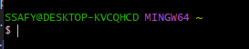

# Gitbash 사용법

- `~`는 사용자의 홈 디렉토리

- 디렉토리와 폴더는 99퍼 유사함?

 

---

 

### 절대 경로
- 루트에서 목적파일까지 모든 경로가 전부 포함된 것

### 상대 경로
- 현재 기준으로 상대적 위치
- `../` : 이전경로
- `./` : 현재경로

## 터미널 명령어

`touch a.txt` *a.txt 파일을 생성*

`start .` 현재 디렉토리를 엶

`mkdir folder_a` make directory

`ls` list 디렉토리 목록 출력
- `-l` : long style

`pwd` print working directory

`cd ..` change directory

`mv` 같은 폴더 간 이동은 rename이다. 다른 폴더 간으론 진짜 옮겨간다.
- `mv s.txt ../test`
  
`rm q.txt` remove

