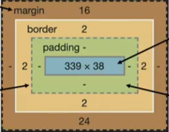

# html


**Protocal**: 규약


### OGP(Open Graph Protocl)

- meta 프로펄티에 설정을 하면 미리보기로 변경가능

  

## 시맨틱 태그

HTML 태그가 특정 목적, 역할 및 의미적 가치(semantic value)를 가지는 것

- header
- nav
- section
- article
- footer


## DOM(Document Object Model)트리

- 텍스트 파일인 HTML 문서를 브라우저에서 렌더링 하기 위한 구조

<em>이건 머지</em>


**html 속성**(attribute)

**html 요소**(element)

- 시작 tag와 종료 tag, 그리고 사이에 위치한 내용으로 구성
- element는 tag로 content를 감싸는 것

- element는 중첩될 수 있음


### form

`<form>`은 정보(데이터)를 서버에 제출하기 위해 사용하는 태그

**기본속성**

- action : 처리할 서버의 URL(데이터를 보낼 곳)
- input에 id, label에 for를 붙혀서 둘을 연관 시킬 수 있다.
- name에 적은 key를 통해 전달된다.

```html
<form action="">
    <div>
        <input type="submit" value="test"> <!-- 서버에 input -->
    </div>
    <div>
        <label for="name">이름을 기재해주세요.</label><br>
        <input type="text" id="name" name="username" autofocus>
    </div>
</form>

```


### input


**속성**

- name
- value
- ....
- label : input 자체의 초점을 맞추거나 활성화 가능
- input에 id, label에 for를 붙혀서 둘을 연관 시킬 수 있다.
- 


**css 선택자**(Selector)

- HTML 태그를 직접 선택
- html에서는 class = ""로 쓰고, css에선 .클래스이름
- 우선순위 Tag, 요소, pseudo-element < Class, 속성, pseudo-class < ID < 인라인
- class = "blue green"일때 green가 우선 순위

**css 결협자**(Combinators)

- 자손 결합자: selector 하위 모든 요소 변경
  - div span {}
- 자식 결합자: selector 바로 아래만 변경
  - div > span {}
- 일반 형제 결합자: 이런게 있군
- 인접 형제 결합자: 이런게 있군

**css 속성**(property)


## 크기단위

em

- 바로 위 부모요소에 대한 상속의 영향을 받음

rem

- 최상위 요소(html)의 사이즈를 기준으로 배수 단위를 가짐


### Box model

margin - border - padding - contents

****


## CSS position

**static** : 기본

**relative** : 상대위치 (기존 위치 기준)

**absolute** : 절대위치 (부모위치 기준, 공중에 뜸)

- static이 아닌 위치(**relative**)를 찾아서, 50,50으로 이동

**fixed** : 항상 고정위치 (공중에 뜸)

**sticky** : 스크롤에따라 static -> fixed