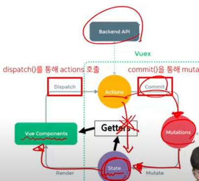

# Vuex

날짜: 2022년 11월 7일 오전 10:47
속성: Vue

# Vuex

상태관리가 무엇인지 이해하기

## State Management

- Web Application 에서의 상태는 어떻게 표현할까?
  
    현재 앱이 가지고 있는 데이터로 표현한다.
    
- component는 독립적이지만,
  
    **여러개의 component가 같은 상태(data)를 유지할 필요가 있음**
    
    → 상태관리(State Management)필요!
    
- 중첩이 깊어지면 데이터 전달이 쉽지않다.

### Centralized Store

: 중앙저장소에 데이터를 모아서 상태 관리

component의 계층에 관계없이 중앙저장소에 접근해서 데이터를 얻거나 변경 가능

### Vuex 시작하기

```jsx
// vue 프로젝트 생성
$ vue create vuex-app  

// 디렉토리이동
$ cd cuex-app

// Vue CLI를 통해 vuex plugin 적용
$ vue add vuex
// 메세지: 뷰 프로젝트가 커밋이 안되있는 상태로 어쩌구 -> YES
```

### src/store/index.js



vuex의 핵심컨셉 4가지

1. state
    1. 중앙에서 관리하는 **모든 상태 정보**
    2. state의 데이터가 변화하면 해당 데이터를 사용하는 component자동으로 렌더링
    3. `$store.state`로 state 데이터에 접근
2. getters
    1. state를 활용해 **계산한 새로운 변수 값**
    2. computed
3. mutations
    - **state를 변경하기 위한 methods 유일한 방법**
    - mutations에서 호출되는 핸들러함수는 반드시 동기적이여야 한다.
    - 비동기 로직으로 mutations를 사용해서 state를 변경하는 경우, 변화의 시기를 특정할 수 없기 때문
    - component혹은 Actions에서 commit()메서드로 호출됨
4. actions
    - **비동기작업이 포함될 수 있는 (외부 API 와의 소통 등) methods**
    - **state를 변경하는 것 외의 모든 로직 진행**
    - state를 직접 변경하지 않고, `commit()`메서드로 mutations를 호출해서 state를 변경함
    - context객체를 인자로 받으며, 이 객체를 통해 store.js의 모든 요소와 메서드에 접근 가능(하지만 직접변경 X )
    - `dispatch()` 메서드에 인해 호출 됨

### 흐름

component에서 데이터를 조작하기 위한 데이터의 흐름

- component→(actions)→mutations→state

component에서 데이터를 사용하기 위한 데이터의 흐름

- state→(getters)→component

component→dispatch→actions→commit→mutations→state 

# Lifecycle Hooks

각 vue 인스턴스는 생성과 소멸의 과정 중 단계별 초기화 과정을 거침

생성과 소멸 사이사이에 훅이 있는데, 이것을 라이프사이클 훅이라고 한다.

- created
-