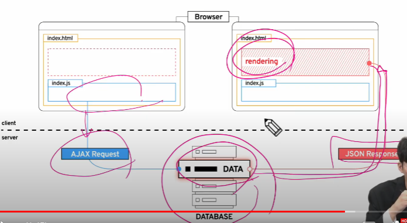
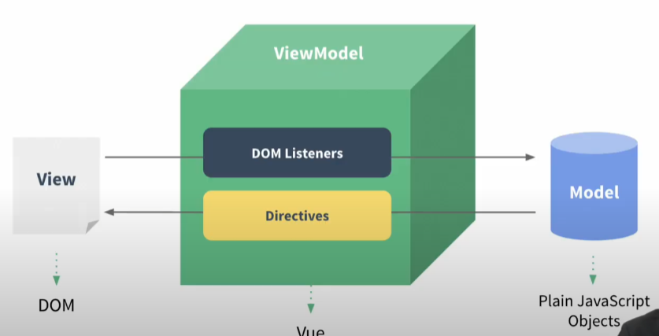

# Vue.js

```jsx
<script src="https://cdn.jsdelivr.net/npm/lodash@4.17.21/lodash.min.js"></script>
<script src="https://cdn.jsdelivr.net/npm/vue/dist/vue.js"></script>
```

# Vue

### Web App

웹 브라우저에서 실행되는 어플리케이션 소프트웨어 (ex. vibe)

특징: 다른 디바이스에서 호환이 된다.

### SPA (Single Page Application)

SPA는 서버에서 최초 1장의 HTML만 전달받아 모든 요청에 대응하는 방식이다.

- CSR(Client Side Rendering)방식으로 한 페이지에서 모든 요청을 대응가능

### CSR (Client Side Rendering)?

- 각 요청에 대한 대응을 JavaScript를 사용하여 필요한 부분만 다시 렌더링
    1. 필요한 페이지를 서버에 AJAX로 요청
    2. **서버는** 화면을 그리기 위해 필요한 **데이터를 JSON방식으로 전달**
    3. JSON데이터를 JavaScript로 처리, DOM트리에 반영(**Client에서 렌더링**)
- 최초로 받아온 것은 빈 HTML문서
- 처리방식 이미지
  
    
    

### SSR (Server Side Rendering)?

클라이언트(사용자)는 서버에서 템플릿을 렌더링한 결과물을 받아 쓰기만 한다. 

### CSR 장점

1. 모든 HTML페이지를 서버로 부터 받아서 표시하지 않아도 됨
    - 클라이언트 - 서버간 통신의 트래픽 감소 → 응답속도가 빨라진다.
2. 매번 새 문서를 받아 새로고침 하는 것이 아니라 **필요한 부분**만 **고쳐** 나가므로 **각 요청이 끊임없이 진행된다.**
3. BE, FE 명확한 구분 가능 → 협업 용이

### CSR 단점

1. 첫 구동 시 데이터가 많으면 오랜 시간이 소요된다.
2. **검색엔진 최적화(SEO, Search Engin Optimiazation)가 어려움**
    1. 서버가 제공하는 것은 텅 빈 HTML
    2. 내용은 AJAX요청으로 얻은 JSON 데이터로 클라이언트가 진행된다.
    3. 빈 HTML은 SPA서비스가 노출되기 어려움 
    - **하지만 검색 대상으로 넓히기 위해 JS를 지원하는 방식으로 발전중**
    - 최적화 문제가 모두  해결된 것은 아니다.

### Vue CDN

- Django == python Web Framework
    - → pip install
- Vue === JS Front-End Framework
    - Bootstrap에서 사용하였던 CDN 방식 제공
- Vue CDN을 위해 Vue2 공식 문서 접속
    - [https://v2.vuejs.org/](https://v2.vuejs.org/)
    1. Getting Started
    2. Installation
    3. Development version CDN 복사
    

### Vue로 코드 작성하기

1. Vue CDN 가져오기
2. Vue instance 생성
    1. Vue instance -1 개의  Object
    2. 정해진 속성 명을 가진 Object
3. el, data설정
    1. data에 관리할 속성 정의
4. 선언적 렌더링 {{ }}
    - Vue data를 화면에 렌더링

# Vue

## MVVM Pattern

### MVVM Pattern

- (Model View ViewModel)
- 소프트웨어 아키택처 패턴의 일종
- 마크업 언어로 구현하는 그래픽 사용자 인터페이스(view)개발을 Back-end(model)로 부터 분리시켜 view가 어느 특정한 모델 플랫폼에 종속되지 않도록 함



- View : 우리 눈에 보이는 부분 = DOM
- Model : 실제 데이터 = JSON
- ViewModel : View를 위한 Model
    - view와 연결(binding) 되어  Action을 주고 받음
    - Model이 변경되면 View Model도 변경되고 바인딩 된 View도 변경됨
    - View에서 사용자가 데이터를 변경하면
    View Model의 데이터가 변경되고 바인딩 된 다른 View도 변경됨

View하고 모델 사이에서 DOM으로부터 이벤트를 듣고 Directives를 사용해서 DOM을 조작 하는 것이다.

### `el:` (element)

`el: '#app'`

- Vue instance와 DOM을 mount(연결)하는 옵션
    - View와 Model을 연결하는 역할
    - **HTML id혹은 class와 마운트** 가능
    - 연결되지 않은 DOM외부는 Vue의 영향을 받지 않음

### `data:`

- Vue instance의 데이터 객체 혹은 인스턴스 속성
- 데이터 객체는 반드시 기본객체 {}(Object)여야 함
- 객체 내부의 아이템들은 value로 모든 타입의 객체를 가질 수 있음
- 정의된 속성은 interpolation {{ }}을 통해 view에 렌더링 가능함
- 추가된 객체의 각 값들은 `this.message` 형태로 접근 가능

 

### `methods:`

- Vue instance의 method들을 정의하는 곳
- methods 객체 정의
    - 객체 내 print method 정의
    - print method 실행 시
- this를 사용하여 데이터 값을 가져온다.
    - app.print()로 호출되기 때문에, this는 app을 가리킨다.
    
    ```jsx
    const app = new Vue({
    ...
    	methods:{
    		print: function(){
    			console.log(this.message)
    			// console.log(this.$data.message)
    			// $는 생략가능
    		},
    	}
    ...
    })
    ```
    

## Basic of Syntax

### Template syntax

- learn → guide → template syntax에 설명 참고
- **렌더링 된  DOM**을 기본 Vue instance의 data에 **선언적으로 바인딩** 할 수 있는 **HTMl 기반 template syntax**를 사용
    - 렌더링 된 DOM : 브라우저에 의해 보기좋게 그려질 HTML 코드
    - HTML 기반 template syntax : HTML코드에 직접 작성할 수 있는 문법 제공
    - **선언적으로 바인딩: Vue instance와 DOM을 연결**

### Directives

- directive의 역할은 **표현식의 값**이 **변경**될 때 **반응적**으로 DOM에 적용할 수 있다.
- v-접두사가 있는 특수속성에는 값을 할당 할 수 있음
    - 값에는 JS표현식을 작성 할 수 있음
- 구조
  
    `v-on:submit.prevent="onSubmit"`
    
    `v-on`: Name
    
    `submit`: Argument
    
    `prevent`: Modifiers
    
    `"onSubmit"`: value
    
    `:`을 통해 전달인자를 받을 수 있음
    
    `.` 으로 표시되는 특수 접미사-directive를 특별한 방법으로 바인딩
    
- 예시:
    1. `v-text`
        - `<p v-text="message"></p>`
        - `{{ message }}`
    2. `v-html`
        1. RAW HTML을 표현할 수 있는 방법 (( 주의: 보안이 약함 ))
    3. `v-show`
        1. 표현식에 작성된 값에 따라element를 보여 줄 것인지 결정
        2. boolean값이 변경 될 때 마다 반응
        3. `display:none`이 기본이다.
        4. 초기 렌더 비용 높음, toggle비용 적음
    4. `v-if`
        1. `v-show`와 비슷하지만, false인 경우 DOM에서 사라진다.
        2. 초기 렌더 비용 작음, toggle비용 높음
        3. 자주 변경되는 경우 비용 증가 
    5. `v-for`
       
        `<div v-for="(char, index) in myStr">`
        
        - 반복한 데이터 타입에 모두 사용가능
        - index를 함꼐 출력하고자 한다면 (char, index)형태로 사용 가능
        - **v-for 사용 시 반드시  key 속성을 각 요소에 작성**
          
            `<div v-for="(char, index) in myStr":key="`arry-${index}`">`
            
            - 주로 v-for directive에 사용
            - vue화면 구성 시 이전과 달라진 점을 확인하는 용도
                - key 중복 불가
            - 각 요소가 고유한 값이 있다면 생략가능
    6. `v-on`
       
        `<button v-on:click="…">` = `<button @click="…">`
        
        `:`:를 통해 전달받은 인자를 확인
        
        - 값으로 JS표현식 작성
        - addEventListener의 첫번째 인자와 동일한 값들로 구성
        - 대기하고 있던 이벤트가 발생하면 할당된 표현식 실행
        - `:` 를 통해 전달된 인자에 특별한 modifiers(수식어)가 있을 수 있음
            - ex) `v-on:keyup.enter` 엔터를 눌렸을 때
    7. `v-bind`
       
        `v-bind:href="url"`
        
        `:` 은 v-bind의 축약어이다.
        
        - HTML기본 속성에 Vue data를 연결
        - class의 경우 다양한 형태로 연결 가능
        - 조건부 바인딩?
        - 다중 바인딩?
    8. `v-model`
        - 양방향 바인딩
        
        문제점: ime, 조합이 필요한 언어에 문제점이 있어서, 한글의 경우 불가능하다.
        

### 기타

- 애로우펑션은 만들때 This가 결정된다.

## Vue advanced

### `computed:`

- computed는 **계산된 값 (함수X)**
- **종속된 것에 변화가 되면 재 계산**
- Vue instance가 가진 options 중 하나
- computed 객체에 정의한 함수를 페이지가 최초로 렌더링 될 때 호출하여 계산
    - 결과가 변하기 전까지 계산된 값만 반환

### methods vs computed

- methods
    - 호출 될 때마다 함수를 실행
    - 같은 결과여도 매번 새롭게 계산
- computed
    - 함수의 종속대상 변화에 따라 계산 여부가 결정됨
    - 대상이 변하지 않으면 항상 저장(캐싱)된 값을 반환

### `watch:`

- **특정 데이터의 변화를 감지한다.**
- 문법
    - number변수를 감시하면서
    - val에 변화된 값, oldVal에는 변화 전 값이 들어간다.
    - 함수 호출 시 handler라는 key를 써야한다.
    
    ```jsx
    watch:{
    	number: function(val, oldVal){
    		console.log(val, oldVal)
    	},
    	name:{
    		handler: 'nameChange' // 함수호출
    	},
    },
    ```
    

### `filters`

텍스트 형식화를 적용할 수 있는 필터

interpolation 혹은 v-bind를 이용할 때 사용 가능

필터는 자바스크립트 표현식 마지막에 `|`(파이프)와 함께 추가되어야 함

이어서 사용(chaining) 가능